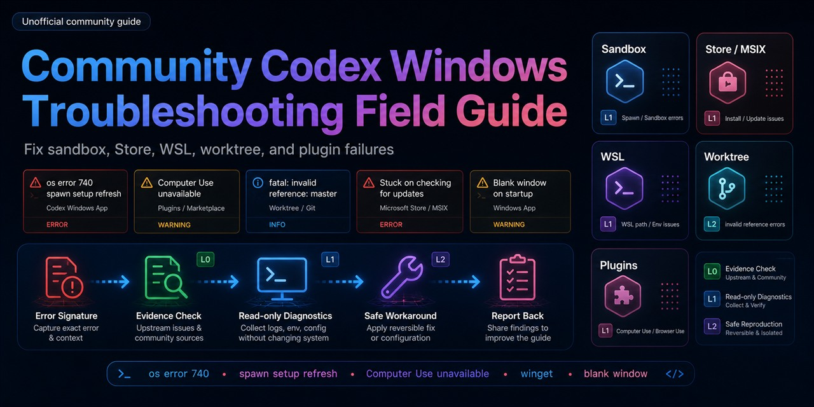

# Community Codex Windows Troubleshooting Field Guide



Community-maintained diagnostics, issue mapping, and safe workarounds for Codex on Windows.

[简体中文](./README.zh-CN.md) · [Error Guide](./WINDOWS-CODEX-ERROR-GUIDE.md) · [Report A Case](https://github.com/toby-bridges/community-codex-windows-troubleshooting/issues/new?template=codex-windows-error.yml) · [Run Diagnostics](#quick-start) · [Contribute](#contribute-a-case)

> Unofficial project. This repository is not affiliated with, endorsed by, or sponsored by OpenAI. See [Branding and Naming](./BRANDING.md).

## One-Line Summary

This GitHub project helps Codex users on Windows diagnose common failures, map them to verified upstream issues, and apply safe troubleshooting steps without guessing.

## Quick Actions

| I want to... | Start here |
| --- | --- |
| Fix a Codex Windows error | Search the exact error in [Windows Codex Error Guide](./WINDOWS-CODEX-ERROR-GUIDE.md) |
| Share a new failure | [Open a redacted case report](https://github.com/toby-bridges/community-codex-windows-troubleshooting/issues/new?template=codex-windows-error.yml) |
| Add an upstream issue or community source | [Submit a source lead](https://github.com/toby-bridges/community-codex-windows-troubleshooting/issues/new?template=codex-windows-error.yml) |
| Validate a workaround | [Follow the contribution rules](./CONTRIBUTING.md) |

## Why This Exists

Codex on Windows can fail in ways that are hard to classify from the UI alone: worktree creation errors, Windows sandbox startup failures, Browser or Computer Use plugin issues, WSL path split-brain, PowerShell quirks, session crashes, and Microsoft Store packaging edge cases.

This project turns scattered GitHub issues and community reports into a verified field guide:

- error signatures you can search for
- evidence levels for each claim
- safe first checks before destructive fixes
- known GitHub issue mappings
- dogfood coverage for every major case in the guide
- read-only diagnostic scripts for local investigation

## Quick Start

If you hit a Codex Windows error, start here:

1. Search the exact error text in [Windows Codex Error Guide](./WINDOWS-CODEX-ERROR-GUIDE.md).
2. Check the case coverage in [Dogfood Matrix](./DOGFOOD-MATRIX.md).
3. Run the read-only diagnostics script from PowerShell:

```powershell
powershell -NoProfile -ExecutionPolicy Bypass -File ".\skills\codex-windows-troubleshooter\scripts\collect-codex-windows-diagnostics.ps1" -Workspace "<YOUR_REPO>"
```

Review the output before posting it publicly.

## Contribute A Case

Raw reports are welcome. You do not need to write a pull request or understand the whole guide to contribute. Maintainers will normalize useful reports into case IDs, guide updates, dogfood rows, and skill/reference updates.

The fastest useful report is:

```text
Error:
Surface: Windows app / CLI / WSL / Browser / Computer Use / Store / winget
Windows:
Codex version:
What happened:
What fixed it, if anything:
Related links:
```

Use one of these paths:

| Path | Best for | Start here |
| --- | --- | --- |
| Error report | You have an exact error message or screenshot text | [Open a redacted case report](https://github.com/toby-bridges/community-codex-windows-troubleshooting/issues/new?template=codex-windows-error.yml) |
| Upstream mapping | You found a relevant `openai/codex` issue, Reddit, V2EX, X, blog, or other source | [Add source context](https://github.com/toby-bridges/community-codex-windows-troubleshooting/issues/new?template=codex-windows-error.yml) |
| Verified fix | You tested a workaround or version boundary safely | [Submit a pull request](./CONTRIBUTING.md) |
| Guide correction | A section is wrong, stale, or too risky | [Contributing rules](./CONTRIBUTING.md) |

Please include the exact error text, Codex surface, Windows version family, Codex version if available, reproduction status, related links, and workaround status. Redact tokens, private repo names, personal paths, screenshots with personal data, and full `.codex` session files.

## Data Flywheel

Each useful contribution should become reusable data, not a one-off support thread:

```text
Raw report -> normalized error signature -> case ID -> guide update -> dogfood check -> skill/reference update
```

Maintainers can do the normalization work. Contributors only need to provide redacted facts: exact error text, environment family, what they tried, and links to upstream/community evidence.

## Top Errors

| Error signature | Likely family | Start here |
| --- | --- | --- |
| `fatal: invalid reference: master` | Git worktree / unborn branch / missing local ref | [Worktree creation failed](./WINDOWS-CODEX-ERROR-GUIDE.md#2-worktree-创建失败fatal-invalid-reference-mastermain) |
| `fatal: invalid reference: main` | Git worktree / repo without local `main` | [Worktree creation failed](./WINDOWS-CODEX-ERROR-GUIDE.md#2-worktree-创建失败fatal-invalid-reference-mastermain) |
| `Computer Use plugins unavailable` | Bundled plugin marketplace / helper paths | [Computer Use / Browser plugins](./WINDOWS-CODEX-ERROR-GUIDE.md#3-computer-use--browser-插件不可用) |
| `No plugins found in marketplace openai-bundled` | Bundled marketplace cache | [Computer Use / Browser plugins](./WINDOWS-CODEX-ERROR-GUIDE.md#3-computer-use--browser-插件不可用) |
| `SetIsBorderRequired failed: 0x80004002` | Windows 10 Computer Use screenshot API | [Windows 10 Computer Use](./WINDOWS-CODEX-ERROR-GUIDE.md#4-windows-10-computer-use-截图失败) |
| `windows sandbox failed: spawn setup refresh` | Windows sandbox helper startup | [sandbox setup refresh](./WINDOWS-CODEX-ERROR-GUIDE.md#5-spawn-setup-refresh--os-error-740) |
| `The requested operation requires elevation. (os error 740)` | UAC / sandbox setup helper | [os error 740](./WINDOWS-CODEX-ERROR-GUIDE.md#5-spawn-setup-refresh--os-error-740) |
| `CreateProcessWithLogonW failed` | Windows sandbox user startup | [other sandbox startup errors](./WINDOWS-CODEX-ERROR-GUIDE.md#6-其他-windows-sandbox-启动错误) |
| `SetTokenInformation(TokenDefaultDacl) failed: 1344` | Windows sandbox DACL edge case | [other sandbox startup errors](./WINDOWS-CODEX-ERROR-GUIDE.md#6-其他-windows-sandbox-启动错误) |
| `RangeError: Invalid string length` | oversized session / rollout JSONL | [large sessions and crashes](./WINDOWS-CODEX-ERROR-GUIDE.md#10-长会话历史记录内存启动崩溃) |

## Covered Error Families

- `fatal: invalid reference: master/main/feature` during Codex worktree creation
- `Computer Use plugins unavailable`
- `No plugins found in marketplace openai-bundled`
- `SetIsBorderRequired failed: 0x80004002`
- `windows sandbox failed: spawn setup refresh`
- `The requested operation requires elevation. (os error 740)`
- `CreateProcessWithLogonW failed`
- `SetTokenInformation(TokenDefaultDacl) failed: 1344`
- sandbox DNS/npm/proxy failures
- WSL and Windows `CODEX_HOME` split-brain
- PowerShell execution, path, and encoding issues
- `RangeError: Invalid string length`
- corrupted `config.toml`
- blank startup windows and Crashpad dumps
- antivirus and enterprise security software blocks
- Microsoft Store install path and ARM64 edge cases

## Evidence Levels

- `A`: official documentation or official engineering posts
- `B`: reproducible `openai/codex` GitHub issues plus system behavior
- `C`: community posts, blogs, Reddit, V2EX, X, or Xiaohongshu
- `D`: engineering inference that still needs reproduction

Workarounds are not treated as solved unless they have repeatable verification or a confirmed version boundary.

## Project Files

- [Windows Codex Error Guide](./WINDOWS-CODEX-ERROR-GUIDE.md)
- [Dogfood Matrix](./DOGFOOD-MATRIX.md)
- [Dogfood Log](./DOGFOOD-LOG.md)
- [Research Sources](./RESEARCH-SOURCES.md)
- [Fact Check: 2026-06-05](./FACT-CHECK-2026-06-05.md)
- [Skill / Plugin Design](./SKILL-PLUGIN-DESIGN.md)
- [Branding and Naming](./BRANDING.md)
- [Distribution Strategy](./DISTRIBUTION-STRATEGY.md)
- [GitHub Launch Checklist](./GITHUB-LAUNCH-CHECKLIST.md)
- [Release Notes](./RELEASE_NOTES.md)
- [Chinese README](./README.zh-CN.md)

## Related Projects

- [CodexGuide](https://github.com/freestylefly/CodexGuide): a broader Codex learning and practice guide for beginners, creators, developers, and teams. Use it for onboarding, workflow design, configuration, and general Codex usage.

This repository stays focused on Codex-on-Windows failures, diagnostics, evidence levels, and safe troubleshooting. If your question is not Windows-specific, CodexGuide is usually the better starting point.

## Contributing

Start with [Contribute A Case](#contribute-a-case) or see [CONTRIBUTING.md](./CONTRIBUTING.md) for redaction, evidence, dogfood, and pull request rules.

## License

MIT. See [LICENSE](./LICENSE).
